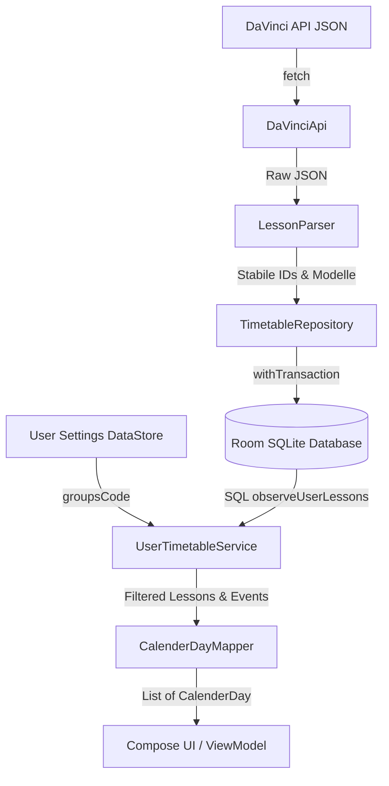

# Timetable Data Guide

## Inhaltsverzeichnis

- [Ziel dieses Dokuments](#ziel-dieses-dokuments)
- [Architektur auf einen Blick](#architektur-auf-einen-blick)
- [Wichtige Grundidee](#wichtige-grundidee)
    - [1. Globale Stundenplandaten](#1-globale-stundenplandaten)
    - [2. User-spezifische Auswahl](#2-user-spezifische-auswahl)
- [Datenmodelle](#datenmodelle)
    - [`Lesson`](#lesson)
    - [`Event`](#event)
    - [`groupsCode`](#groupscode)
    - [`CalenderDay`](#calenderday)
    - [`extraLessons`](#extralessons)
    - [`hiddenLessons`](#hiddenlessons)
    - [`UserSchedulePreferences`](#userschedulepreferences)
- [Zuständigkeiten der Klassen](#zuständigkeiten-der-klassen)
    - [`DaVinciApi`](#davinciapi)
    - [`LessonParser`](#lessonparser)
    - [`CalenderDayMapper`](#calenderdaymapper)
    - [`TimetableRepository`](#timetablerepository)
    - [`UserSchedulePreferencesStore`](#userschedulepreferencesstore)
    - [`UserTimetableService`](#usertimetableservice)
    - [`TimetableAlertDetector`](#timetablealertdetector)
- [Reihenfolge und Atomarität der User-Regeln](#reihenfolge-und-atomarität-der-user-regeln)
- [Datenfluss im Detail](#datenfluss-im-detail)
    - [Erstes Laden der App](#erstes-laden-der-app)
    - [Erstes Laden der App ohne Internet](#erstes-laden-der-app-ohne-internet)
    - [Späterer App-Start ohne Internet](#späterer-app-start-ohne-internet)
    - [Update-Prüfung](#update-prüfung)
    - [Persönlicher Stundenplan eines Users](#persönlicher-stundenplan-eines-users)
- [Was die UI später wirklich benutzen sollte](#was-die-ui-später-wirklich-benutzen-sollte)
- [Empfohlener UI-Startablauf](#empfohlener-ui-startablauf)
- [Welche Methode wann benutzt werden sollte](#welche-methode-wann-benutzt-werden-sollte)
- [Typische Anwendungsfälle](#typische-anwendungsfälle)
- [Fehler- und Offlineverhalten](#fehler-und-offlineverhalten)
- [Wichtige technische Hinweise](#wichtige-technische-hinweise)
- [Bewusst nicht umgesetzt](#bewusst-nicht-umgesetzt)
- [Sinnvolle nächste Schritte](#sinnvolle-nächste-schritte)
- [Kurzfassung](#kurzfassung)
- [Guidelines für die ViewModel-Implementierung](#guidelines-für-die-viewmodel-implementierung)
- [Hinweise an den Data-Entwickler: Was wurde warum geändert?](#hinweise-an-den-data-entwickler-was-wurde-warum-geändert)

---

## Ziel dieses Dokuments

Dieses Dokument beschreibt die relationale, MVVM-konforme Datenarchitektur der App. Es ist für
Entwickler gedacht, die später UI, ViewModel, Worker oder weitere Features mit dem Datenlayer
verbinden.

Der Fokus liegt auf diesen Fragen:

- Woher kommen die Stundenplandaten?
- Wo werden sie gespeichert und wie ist das Datenbankschema relational normalisiert?
- Welche Klasse ist für was zuständig?
- Welche Methoden und Flows sollen von UI oder ViewModel benutzt werden?
- Wie wird aus globalen Daten der persönliche Stundenplan eines Users gebaut?
- Welche Richtlinien müssen bei der Implementierung von ViewModels beachtet werden?

---

## Architektur auf einen Blick

Der Datenfluss ist schichtenbasiert aufgebaut:

1. **DaVinciApi.kt**: Lädt die aktuelle JSON-Stundenplandatei über HTTP vom Server.
2. **LessonParser.kt**: Parst die JSON-Rohdaten in Domänen-Modelle wie `Lesson` und `Event` und
   generiert stabile IDs über `lessonRef#date`.
3. **TimetableRepository.kt**: Zentrale Datenquelle (Single Source of Truth) für alle globalen
   Stundenplandaten. Speichert Snapshots transaktional in Room ab und stellt reaktive Daten-Flows
   bereit.
4. **UserSchedulePreferencesStore.kt**: Speichert einfache Benutzereinstellungen (wie die gewählte
   Studiengruppe) im Preferences DataStore.
5. **UserTimetableService.kt**: Verwaltet die Custom-Regeln und stellt den reaktiven persönlichen
   Stundenplan bereit. Die Filterung läuft hochperformant direkt in SQLite über
   Room-Datenbankabfragen.
6. **CalenderDayMapper.kt**: Führt gefilterte `Lesson`- und `Event`-Modelle zu einer tagesweisen
   Darstellung (`List<CalenderDay>`) zusammen.

### Datenfluss im Überblick



---

## Wichtige Grundidee

Es gibt zwei Datenebenen:

### 1. Globale Stundenplandaten

Das sind alle `Lesson`- und `Event`-Einträge aus DaVinci. Diese Daten gelten für alle User und
liegen lokal in Room. Um Redundanzen zu vermeiden und die erste Normalform (1NF) zu gewährleisten,
wurden alle Collections (Räume, Dozenten, Studiengänge) in relationale Zwischentabellen ausgelagert.
Dadurch entfallen TypeConverter.

### 2. User-spezifische Auswahl

Das sind persönliche Einstellungen und Filterwünsche des Nutzers:

- Welcher primäre `groupsCode` gewählt wurde (liegt im DataStore).
- Welche Fremdmodule aufgenommen werden (`extra_lessons`-Tabelle in Room).
- Welche Einheiten ausgeblendet werden (`hidden_lessons`-Tabelle in Room).

> [!NOTE]
> Der persönliche Stundenplan wird nicht als eigene Tabelle gespeichert. Er wird reaktiv über
> SQLite-JOINs direkt in Room gefiltert und zur Laufzeit berechnet.

---

## Datenmodell

### Lesson

**Datei:** `Lesson.kt`

`Lesson` repräsentiert eine konkrete Lehrveranstaltung wie Vorlesung, Übung oder Labor mit einer
festen Uhrzeit an einem bestimmten Datum. Eine Lesson findet in einem bestimmten Raum mit Dozenten
statt und ist einem oder mehreren `groupsCodes` zugeordnet.

Wichtige Felder:

- `id`: Die stabile, eindeutige ID (generiert aus `lessonRef#date` oder Fallback-Hash).
- `title`: Name der Lehrveranstaltung.
- `date`: Datum im Format `YYYY-MM-DD`.
- `startTime` / `endTime`: Uhrzeiten im Format `HH:MM`.
- `rooms`: Ein Set der Raumcodes (z. B. "4/302").
- `building`: Gebäudekürzel (z. B. "H4").
- `teacher`: Ein Set von Dozentenkürzeln.
- `groupsCode`: Set von Studiengangscodes (z. B. "eti-SKIB_4").
- `change`: Optionale Änderungsinformationen.

> [!TIP]
> Die ID wird im Parser deterministisch und stabil erzeugt. Raum- oder Dozentenänderungen haben
> keinen Einfluss mehr auf die ID. Damit greifen im Speicher liegende User-Regeln, die auf diese
`lessonId` verweisen, auch nach Updates stabil.

### Event

**Datei:** `Event.kt`

`Event` repräsentiert globale Termine wie Ferien, Feiertage oder Prüfungsphasen, die für die gesamte
Hochschule gelten. Ein Event hat ein Start- und Enddatum, aber keine feste Uhrzeit, keinen Raum und
keinen Studiengruppenbezug.

Wichtige Felder:

- `id`
- `title`
- `startDate`
- `endDate`
- `category`

Events können mehrere Tage umfassen. Die Verteilung auf einzelne Kalendertage macht später
`CalenderDayMapper.kt`.

### groupsCode

Ein `groupsCode` wie `eti-SKIB_4` oder `mb-SPB_4` repräsentiert typischerweise ein Semester eines
Studiengangs.

Beispiel `eti-SKIB_4`:

- Fakultät: Elektrotechnik und Informatik
- Studiengang: Softwareentwicklung und künstliche Intelligenz
- Semester: 4

Im Setup-Prozess wählt der Nutzer seinen primären `groupsCode`. Da Vorlesungen häufig von mehreren
Studiengängen geteilt werden, besitzt jede Lesson ein Set von `groupsCodes`.

### CalenderDay

**Datei:** `CalenderDay.kt`

`CalenderDay` ist die UI-freundliche Tagesansicht.

Felder:

- `date`
- `lessons`
- `events`

Bei regulärer Nutzung einer Tages- oder Wochenansicht sollte die UI mit `List<CalenderDay>`
arbeiten. Typische Fälle für die direkte Nutzung von `Lesson` oder `Event` statt `CalenderDay` sind:

- Detail-Screen einer Lesson
- Suche nach Lessons für `extraLessons`
- Filter- oder Auswahlmasken
- Notification-Logik zur Änderungserkennung

### extraLessons

`extraLessons` sind Lessons, die der Nutzer zusätzlich in seinem Plan anzeigen möchte, obwohl sie
nicht zu seinem primären `groupsCode` gehören. Technisch werden diese relational in SQLite in der
Tabelle `extra_lessons` gespeichert. Ein Fremdschlüssel verweist bei Einzelterminen auf die stabile
`LessonEntity.id`.

### hiddenLessons

`hiddenLessons` sind Regeln für Lessons, die der Nutzer aus dem Plan ausblenden möchte. Technisch
werden diese in SQLite in der Tabelle `hidden_lessons` gespeichert. Ein Fremdschlüssel verweist bei
Einzelterminen auf die stabile `LessonEntity.id`.

### UserSchedulePreferences

**Datei:** `UserSchedulePreferences.kt`

Enthält nur noch einfache Einstellungen wie:

- `isSetupComplete`
- `groupsCode`
- `isDynamicColorEnabled`
- `isCancellationAlertEnabled`
- `isRoomChangeAlertEnabled`
- `moduleEmojis` (Speichert Modulname -> Emoji Zuordnungen)

Da komplexe JSON-Regeln in relationale Room-Tabellen ausgelagert wurden, bleibt diese
Preferences-Klasse klein, performant und typsicher.

---

## Zuständigkeiten der Klassen

### DaVinciApi

**Datei:** `DaVinciApi.kt`

- Lädt die DaVinci-JSON aus dem Netz.
- Berechnet Hash und Größe der Antwort zur Cache-Validierung.
- Parst die Root-JSON in `DaVinciResponse`.
- Läuft vollständig auf `Dispatchers.IO`.

### LessonParser

**Datei:** `LessonParser.kt`

- `lessonTimes` aus der API in `Lesson` umwandeln.
- `eventTimes` aus der API in `Event` umwandeln.
- Daten und Zeiten formatieren.
- Stabile Lesson-IDs erzeugen. Wenn `lessonRef` vorhanden ist, wird `lessonRef#date` genutzt,
  ansonsten wird ein stabiler Fallback-Hash (ohne Räume/Dozenten) erzeugt.
- Bei strukturell defekter API-Antwort fail-fast abbrechen.

### CalenderDayMapper

**Datei:** `CalenderDayMapper.kt`

- Lessons nach Datum gruppieren und chronologisch sortieren.
- Events auf alle betroffenen Tage verteilen.
- Daraus `List<CalenderDay>` bauen.

### TimetableRepository

**Datei:** `TimetableRepository.kt`

- Lädt Stundenplandaten relational aus Room.
- Lädt neue Daten aus dem Netz und speichert sie relational in Room über eine sichere Transaktion (
  `database.withTransaction`).
- Stellt globale Flows bereit (`lessonsFlow`, `eventsFlow`, `calenderDaysFlow`).

#### Lokale Speicherung in Room:

- `LessonEntity.kt` (Tabelle: `lessons` - normalisiert, keine Kollektionen)
- Zwischentabellen für Beziehungen in `LessonRelations.kt` (`lesson_rooms`, `lesson_teachers`,
  `lesson_groups`)
- `EventEntity.kt` (Tabelle: `events`)
- `SyncMetadataEntity.kt` (Tabelle: `sync_metadata` mit Hash und Größe)

### UserSchedulePreferencesStore

**Datei:** `UserSchedulePreferencesStore.kt`

- Speichert User-Einstellungen in DataStore.
- Liefert einen reaktiven `Flow<UserSchedulePreferences>`.

### UserTimetableService

**Datei:** `UserTimetableService.kt`

- Verwalte die Filterregeln (`extra_lessons` und `hidden_lessons`) relational in Room.
- Bietet reaktive Flows für den gefilterten Stundenplan (`userLessonsFlow()`,
  `userCalenderDaysFlow()`).
- Delegiert die Filterberechnungen reaktiv direkt an SQLite (über die DAO-Methode
  `observeUserLessons`).

### TimetableAlertDetector

**Datei:** `TimetableAlertDetector.kt`

- Vergleicht den alten Stundenplan des Nutzers mit den neu synchronisierten globalen
  Stundenplandaten.
- Detektiert Ausfälle (Einheit existiert im neuen Plan nicht mehr) und Raumänderungen (Raum weicht
  ab) unter Verwendung stabiler Koordinatenvergleiche.
- Liefert eine Liste von `TimetableAlert`-Objekten an Services oder Worker zur Anzeige lokaler
  Push-Benachrichtigungen.

### TimtableSyncWorker

**Datei:** `TimtableSyncWorker.kt`

- Führt im Hintergrund periodisch (alle 1,5 Stunden zwischen 07:00 und 19:00 Uhr) die Synchronisierung durch.
- Holt den aktuellen Stundenplan-Snapshot des Nutzers vor dem Update.
- Triggere `repository.updateJsonIfNeeded()`.
- Vergleicht bei neuen Daten den alten und neuen Zustand mittels `TimetableAlertDetector.detectAlerts(...)`.
- Liest die Benachrichtigungseinstellungen (`isCancellationAlertEnabled`, `isRoomChangeAlertEnabled`) aus und erstellt lokale Systembenachrichtigungen für jeden aktivierten Alert im Notification Channel `timetable_alerts`.


---

## Reihenfolge und Atomarität der User-Regeln

Die Filterlogik ist vollständig in die SQL-Datenbankabfrage in `LessonDao.observeUserLessons`
gekapselt:

1. Nimm alle Vorlesungen des primären `groupsCode` des Benutzers.
2. Füge alle Vorlesungen hinzu, die der Benutzer manuell als Fremdmodul ausgewählt hat (entweder als
   Einzeltermin über die `lessonId` oder kursweit über Titel und Studiengang).
3. Blende alle Vorlesungen aus, für die eine Ausblendungsregel existiert (entweder als Einzeltermin
   über die `lessonId` oder kursweit über Titel und optionalen Studiengang).
4. Sortiere das Ergebnis chronologisch nach Datum und Startzeit.

> [!IMPORTANT]
> Blacklist-Regeln (`hidden_lessons`) gewinnen immer gegen Whitelist-Regeln (`extra_lessons`). Ist
> dieselbe Lesson sowohl extra als auch hidden, wird sie ausgeblendet.

---

## Datenfluss im Detail

### Erstes Laden der App

1. UI oder ViewModel erzeugt `TimetableRepository`.
2. `initialize()` wird aufgerufen.
3. Repository prüft Room; falls leer, wird das API-JSON über `reloadJson()` geladen.
4. Parser erzeugt `Lesson` und `Event`.
5. Repository speichert alles transaktional in Room (befüllt `lessons` sowie relationale
   Zwischentabellen).
6. UI zeigt Daten reaktiv an.

### Erstes Laden der App ohne Internet

1. `initialize()` wird aufgerufen.
2. Room ist leer, also wird versucht, das Netz-JSON über `reloadJson()` zu holen.
3. Netzwerk schlägt fehl; `syncState` wechselt auf `Error` mit `hasLocalData = false`.
4. Die Exception wird weitergeworfen, und die UI muss reagieren (z. B. Retry-Bildschirm anzeigen).

### Späterer App-Start ohne Internet

1. `initialize()` wird aufgerufen.
2. Room enthält bereits Daten aus dem vorherigen Sync.
3. Daten werden lokal gelesen und in den RAM-Cache geladen; UI zeigt Offline-Daten an.

### Update-Prüfung

1. `updateJsonIfNeeded()` lädt das neue JSON und vergleicht den Hash mit `SyncMetadataEntity`.
2. Wenn verschieden: Die alten Room-Tabellen werden gelöscht (was kaskadierend die Zwischentabellen
   leert) und die neuen Daten werden relational eingefügt.
3. Wenn gleich: Keine Änderungen in Room, RAM-Cache wird neu aufgebaut.

### Persönlicher Stundenplan eines Users

1. User schließt das Setup ab. Der `groupsCode` wird im DataStore gespeichert.
2. `UserTimetableService` beobachtet die Einstellungsänderung.
3. Die Room-Abfrage `observeUserLessons` wird mit dem neuen Code aufgerufen.
4. SQLite filtert und sortiert den Stundenplan und liefert das Ergebnis reaktiv an den
   `CalenderDayMapper` und die UI zurück.

---

## Was die UI später wirklich benutzen sollte

Die UI darf niemals direkt mit Parsern, Entitäten oder Room-DAOs kommunizieren. Sie kommuniziert
ausschließlich mit:

- `TimetableRepository.kt` (für globale Aktionen und Sync-Status)
- `UserTimetableService.kt` (für den persönlichen Kalender und das Regel-Management)

---

## Empfohlener UI-Startablauf

### Für globale Daten im ViewModel:

```kotlin
class TimetableViewModel(
    application: Application,
    private val repository: TimetableRepository
) : AndroidViewModel(application) {

    val calenderDays = repository.calenderDaysFlow
    val syncState = repository.syncState

    init {
        viewModelScope.launch {
            try {
                repository.initialize()
                repository.updateJsonIfNeeded()
            } catch (e: Exception) {
                // Fehlerbehandlung für UI
            }
        }
    }
}
```

### Für den persönlichen Stundenplan:

```kotlin
class UserTimetableViewModel(
    application: Application,
    private val repository: TimetableRepository,
    private val userService: UserTimetableService
) : AndroidViewModel(application) {

    val userCalenderDays = userService.userCalenderDaysFlow()
    val preferences = userService.preferencesFlow
    val syncState = repository.syncState

    init {
        viewModelScope.launch {
            try {
                repository.initialize()
                repository.updateJsonIfNeeded()
            } catch (e: Exception) {
                // Fehlerbehandlung
            }
        }
    }
}
```

### In Compose:

```kotlin
@Composable
fun TimetableScreen(viewModel: UserTimetableViewModel) {
    val days by viewModel.userCalenderDays.collectAsState(initial = emptyList())
    val syncState by viewModel.syncState.collectAsState()

    // days rendern, syncState für Ladeanimation/Offline-Banner nutzen
}
```

---

## Welche Methode wann benutzt werden sollte

### Bei App-Start

- `repository.initialize()` gefolgt von `repository.updateJsonIfNeeded()`

### Für Setup-Screen

- `userService.completeSetup(groupsCode)`

### Für normales Anzeigen des persönlichen Stundenplans

- `userService.userCalenderDaysFlow()`

### Für einmalige direkte Abfragen

- `repository.getLessonsByGroupsCode(...)`
- `repository.getLessonById(...)`
- `repository.getLessonsByTitleAndGroupsCode(...)`

### Für manuelles Refresh

- `repository.reloadJson()`

### Für stilles Hintergrund-Update

- `repository.updateJsonIfNeeded()` (z. B. periodisch über einen WorkManager)

---

## Typische Anwendungsfälle

### 1. User wählt seinen Studiengang zum ersten Mal

```kotlin
viewModelScope.launch {
    userService.completeSetup("mb-MBB_4")
}
```

### 2. User fügt ein Fremdmodul hinzu

**Kursweit über Titel:**

```kotlin
viewModelScope.launch {
    userService.addExtraLesson(
        groupsCode = "eti-SKIB_4",
        title = "Informatik"
    )
}
```

**Einzelner Termin über ID:**

```kotlin
viewModelScope.launch {
    userService.addExtraLessonById(lessonId)
}
```

### 3. User blendet nur eine bestimmte Woche aus

```kotlin
viewModelScope.launch {
    userService.hideLessonById(lessonId)
}
```

### 4. User blendet ein Modul eines bestimmten Codes aus

```kotlin
viewModelScope.launch {
    userService.hideLesson(
        groupsCode = "mb-MBB_4",
        title = "Mathe"
    )
}
```

### 5. User macht alles wieder sichtbar

```kotlin
viewModelScope.launch {
    userService.showLessonById(lessonId)
}
```

---

## Fehler- und Offlineverhalten

### Offline beim normalen App-Start mit bestehenden lokalen Daten

Wenn Room bereits Daten hat, wird lokal gelesen. Die App startet fehlerfrei offline.

### Offline beim Update

`updateJsonIfNeeded()` fängt Netzfehler ab. Lokale Daten bleiben aktiv, die Methode liefert `false`
zurück.

### Offline beim allerersten Start ohne lokale Daten

`initialize()` scheitert. `syncState` wechselt auf `Error` mit `hasLocalData = false`. Exception
wird weitergegeben, die UI sollte einen blockierenden Fehlerbildschirm mit Wiederholungs-Option
anbieten.

---

## Wichtige technische Hinweise

1. **Vor Getter-Nutzung initialisieren**: Vor der Benutzung der einmaligen RAM-Getter im Repository
   muss mindestens einmal `repository.initialize()` aufgerufen worden sein, um den Speicher-Cache
   aufzubauen.
2. **Für UI lieber Flows als einmalige Getter**: Verwende für Compose-basierte Benutzeroberflächen
   immer die reaktiven Flows (`userCalenderDaysFlow()`), da diese sich bei Regeländerungen
   automatisch aktualisieren.
3. **Netzwerk- und Parsing-Logik nicht in die UI verschieben**: Die UI darf keine Netzaufrufe
   tätigen, nicht direkt in die DB schreiben und keine API-JSONs verarbeiten. Diese Komplexität ist
   vollständig in den Daten- und Service-Klassen gekapselt.
4. **CalenderDay ist absichtlich die Anzeigeform**: Der Kalender-Screen rendert `List<CalenderDay>`.
   Direkte Vorlesungslisten sind für Detail-Ansichten oder Suchen gedacht.
5. **Schreibweise CalenderDay**: Im Projekt heißt die Klasse `CalenderDay` (mit "e"). Aus Gründen
   der Konsistenz muss diese Schreibweise beibehalten werden.

---

## Bewusst nicht umgesetzt

- Vollständige server-seitige Push-Infrastruktur (Firebase Cloud Messaging). Stattdessen wird lokales Polling per WorkManager verwendet.

---

## Implementierte Features (kürzlich hinzugefügt)

1. **ViewModel-Anbindung**: `SettingsViewModel` und `TimetableViewModel` binden nun die neuen Einstellungen (dynamische Farbe, Benachrichtigungen) und die Modul-Emoji Zuordnungen direkt an den Service an.
2. **WorkManager-Integration**: Periodischer Hintergrund-Worker `TimtableSyncWorker` (ausgeführt alle 1,5 Stunden zwischen 07:00 und 19:00 Uhr) zur Prüfung auf Stundenplan-Updates und zur lokalen Benachrichtigung bei Ausfällen/Änderungen.

---

## Kurzfassung

- Globale Daten kommen aus `TimetableRepository.kt`.
- Einstellungen kommen aus `UserSchedulePreferencesStore.kt`.
- Regeln und gefilterte Stundenpläne kommen aus `UserTimetableService.kt`.
- Room dient als persistenter SQLite-Speicher.
- Kalenderdaten werden reaktiv über Flows gestreamt.

---

## Guidelines für die ViewModel-Implementierung

> [!IMPORTANT]
> Diese Richtlinien müssen bei der Implementierung von ViewModels strikt beachtet werden, um die
> Architektur sauber zu halten und Kompilierfehler oder fehlerhafte Datenflüsse zu vermeiden.

1. **Kein Direktzugriff auf interne Datenklassen oder DAOs**:
    - Ein ViewModel darf niemals direkt auf `LessonDao`, `UserRulesDao` oder
      `UserSchedulePreferencesStore` zugreifen.
    - Alle Interaktionen bezüglich des gefilterten Stundenplans, der Einstellungen und der
      Filterregeln müssen über `UserTimetableService.kt` laufen.
    - Alle Interaktionen bezüglich der globalen Stundenplandaten und Synchronisationsprozesse müssen
      über `TimetableRepository.kt` laufen.
2. **Kapselung asynchroner Operationen**:
    - Schreiboperationen wie `completeSetup()`, `addExtraLessonById()` oder `hideLessonById()` sind
      `suspend`-Funktionen. Rufe sie immer im `viewModelScope` des ViewModels auf.
    - Synchronisationsmethoden wie `initialize()`, `reloadJson()` oder `updateJsonIfNeeded()` sind
      ebenfalls `suspend`-Funktionen und müssen im `viewModelScope` gestartet und mit `try-catch`
      -Blöcken abgesichert werden.
3. **Reaktive Datenbindung in Compose**:
    - Exponiere Datenströme als Kotlin-`Flow` (z. B. `userService.userCalenderDaysFlow()`).
    - Nutze im ViewModel vorzugsweise
      `.stateIn(viewModelScope, SharingStarted.WhileSubscribed(5000), emptyList())`, um die
      Kälte-Flows der DB in heiße `StateFlows` umzuwandeln. Das verhindert, dass die Datenbank bei
      jedem Neuausrichten des UI-Bildschirms (Recomposition) neu abgefragt wird.
4. **Kombination von UI-States**:
    - Beobachte den `syncState` des Repositories reaktiv, um Lade- (`LoadingLocal`, `Syncing`),
      Fehler- (`Error`) oder Bereitschaftszustände (`Ready`) an die UI weiterzugeben.

---

## Was wurde warum geändert?

Hier ist die Erklärung der Architekturänderungen im Vergleich zum letzten Commit (PR), damit du
verstehst, wie das neue relationale Modell arbeitet:

### 1. Warum wurden die Collections aus `LessonEntity` entfernt?

- **Das Problem zuvor**: `rooms`, `teacher` und `groupsCode` waren als Kollektionen direkt in der
  Klasse `LessonEntity` deklariert und wurden über einen `TypeConverter` als JSON-Strings in eine
  einzelne Tabellenspalte geschrieben.
- **Die Lösung**: Das widerspricht der 1. Normalform von relationalen Datenbanken. Wir haben diese
  Kollektionen in drei eigenständige Junction-Tabellen ausgelagert (`lesson_rooms`,
  `lesson_teachers` und `lesson_groups`).
- **Der Vorteil**: Wir benötigen keinen fehleranfälligen JSON-TypeConverter mehr. Zudem können wir
  nun performante SQL-Abfragen über Fremdschlüssel (`ForeignKey`) ausführen. Die Beziehungen sind
  mit `onDelete = ForeignKey.CASCADE` abgesichert. Das bedeutet: Löschen wir eine Vorlesung, löscht
  SQLite automatisch alle zugehörigen Raum-, Dozenten- und Studiengangsbeziehungen aus den
  Zwischentabellen.

### 2. Warum liegen die Filterregeln nun in Room statt im Preferences DataStore?

- **Das Problem zuvor**: Die benutzerdefinierten Auswahlen (`extraLessons` und `hiddenLessons`)
  wurden als serialisierte JSON-Strings im Preferences DataStore abgelegt. Wollten wir den
  Stundenplan anzeigen, mussten wir alle globalen Vorlesungen aus Room laden, die JSON-Regeln im RAM
  parsen und in Kotlin-Code filtern (Laufzeitkomplexität O(N*M)). Zudem gab es keine referenzielle
  Integrität: Änderten sich die IDs der Vorlesungen in Room, zeigten die IDs im DataStore auf tote
  Einträge.
- **Die Lösung**: Die Regeln wurden in die SQLite-Tabellen `extra_lessons` und `hidden_lessons`
  überführt. Einzeltermin-Regeln referenzieren nun direkt per `ForeignKey` die stabile ID der
  Tabelle `lessons`.
- **Der Vorteil**: Wir haben echte referenzielle Integrität. Wenn eine Vorlesung komplett
  abgesagt/gelöscht wird, sorgt `onDelete = ForeignKey.CASCADE` dafür, dass SQLite die verknüpfte
  Filterregel automatisch mit wegräumt. Außerdem wird die Filterung über die DAO-Abfrage
  `observeUserLessons` direkt per SQL (JOINs und EXISTS-Klauseln) in der Datenbank-Engine
  durchgeführt. Das ist um ein Vielfaches schneller und schont die Systemressourcen des Smartphones.

### 3. Warum wurde die ID-Generierung in `LessonParser` geändert?

- **Das Problem zuvor**: Die ID wurde als Hash ausnahmslos aller Attribute erzeugt – inklusive Räume
  und Dozenten. Änderte sich beispielsweise bei einer Vorlesung der Raum, änderte sich deren ID. Die
  Folge: Die Fremdschlüsselverbindung in `extra_lessons` oder `hidden_lessons` wurde kaskadierend
  gelöscht, und die Vorlesung verschwand ungewollt aus dem gefilterten Nutzerstundenplan.
- **Die Lösung**: Die ID wird jetzt primär über die von der API bereitgestellte `lessonRef`
  kombiniert mit dem Datum erzeugt (`lessonRef#date`). Für Zusatzstunden ohne `lessonRef` gibt es
  einen Fallback-Hash, der flüchtige Felder wie Dozenten oder Räume bewusst ausschließt.
- **Der Vorteil**: Die ID bleibt auch bei Raum- oder Dozentenwechseln absolut stabil. Die
  Verknüpfungen des Nutzers brechen bei Stundenplanaktualisierungen nicht mehr ab.
